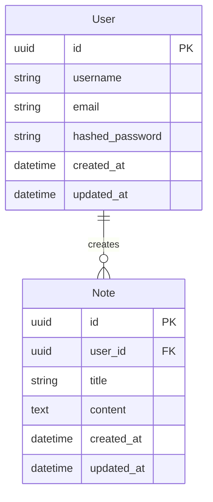

# Database Schema Documentation

## Overview

The Friday API service uses SQLAlchemy ORM with SQLite as the default database. The schema is designed to support user authentication and note management.

## Entity Relationship Diagram



## Tables

### User

The `User` table stores user account information.

| Column          | Type      | Constraints       | Description                    |
|----------------|-----------|------------------|--------------------------------|
| id             | UUID      | PK, NOT NULL     | Unique identifier             |
| username       | String    | UNIQUE, NOT NULL | User's login name             |
| email          | String    | UNIQUE, NOT NULL | User's email address          |
| hashed_password| String    | NOT NULL         | Bcrypt hashed password        |
| created_at     | DateTime  | NOT NULL         | Record creation timestamp     |
| updated_at     | DateTime  | NOT NULL         | Record last update timestamp  |

Indexes:
- PRIMARY KEY (id)
- UNIQUE INDEX (username)
- UNIQUE INDEX (email)

### Note

The `Note` table stores user notes.

| Column     | Type      | Constraints           | Description                    |
|-----------|-----------|----------------------|--------------------------------|
| id        | UUID      | PK, NOT NULL         | Unique identifier             |
| user_id   | UUID      | FK, NOT NULL         | Reference to User.id          |
| title     | String    | NOT NULL             | Note title                    |
| content   | Text      | NOT NULL             | Note content                  |
| created_at| DateTime  | NOT NULL             | Record creation timestamp     |
| updated_at| DateTime  | NOT NULL             | Record last update timestamp  |

Indexes:
- PRIMARY KEY (id)
- INDEX (user_id)
- INDEX (created_at)

Foreign Keys:
- user_id REFERENCES User(id) ON DELETE CASCADE

## Migrations

Database migrations are managed using Alembic. Migration files are stored in the `migrations` directory.

To run migrations:

```bash
# Create a new migration
alembic revision --autogenerate -m "description"

# Apply migrations
alembic upgrade head

# Rollback last migration
alembic downgrade -1
```

## Caching

Redis is used for caching frequently accessed data:

- User sessions (TTL: 24 hours)
- Note listings (TTL: 5 minutes)
- Individual notes (TTL: 5 minutes)

Cache keys follow these patterns:
- User sessions: `session:{user_id}`
- Note listings: `notes:user:{user_id}`
- Individual notes: `note:{note_id}` 